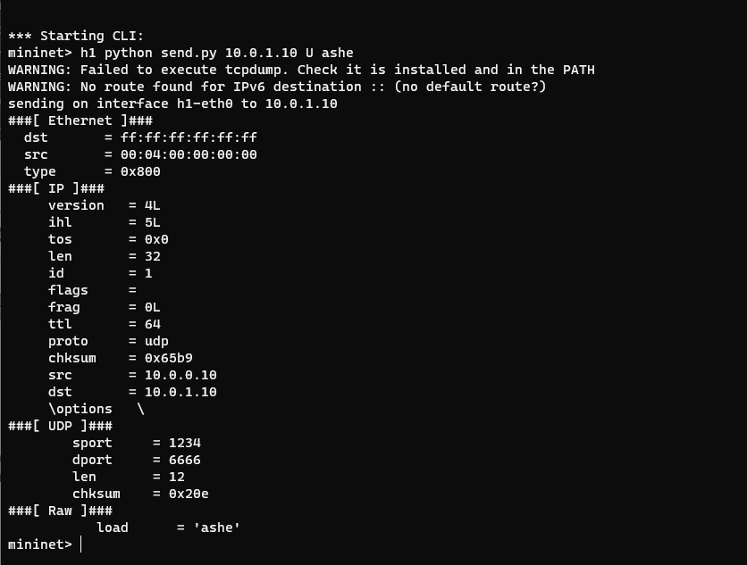
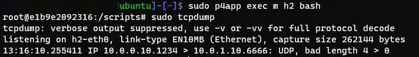

# BOLT

This is the repository for the prototype of our work in INFOCOM'2021, "Making Multi-String Pattern Matching Scalable and Cost-Efficient with Programmable Switching ASICs".
This project is aiming at accommodating more matching patterns and allowing correlated patterns match within a PISA switch.

## Requirements

We use Aho-Corasick algorithm as an example to match the pattern. To run it, please install the denpendcies first

```bash
pip install pyahocorasick
```
The usage of the project is based on `p4lang/p4app`, so be sure you have cloned this repo and installed `docker`.

We use `python2.7` as the interpreter, and leave migrating to newer version (such as `python3.x`) as future work.

## Usage


### Define the pattern set

You can define the ruleset you want to match in `p4app/controller.py`. For example, we define `she | he | her` to present the pattern set looking for the packets containing one of them in payload.

### Entries generation

After defining the ruleset, run `controller.py` and it will generate the switch config instructions to install entries in the switch. The instructions are outputed in plain text, and you can redirect the output to write in `switch.config`, or just copy them into it from standard I/O. The instructions in `swith.config` will be executed by `p4app` program later.


### Run the P4 simulated network

To run the p4app simulation program, you can:
   
```bash
sudo p4app run ./p4app/
```

Then you will find a Mininet command prompt. `p4app` will automatically run a Docker image containing the P4 compiler and tools such as Mininet scripts, compile the p4 program (`pattern_match_switch.p4`) and set up a container with a Mininet-based simulated network. The instructions you added in `switch.config` will be carried out on the swtich in this step automatically.
 
Then you can run the `send.py` in a host in this network to send some packets to the p4 switch, and `tcpdump` or `receive.py` in another host to check if the packets containing pattern(s) are forwarded by the switch according to the ruleset.


```
mininet> h1 python send.py 10.0.1.10 U ashe
```
In another shell in hostOS:
```
sudo p4app exec m h2 bash
cd /tmp
python receive.py
```

(Refer to [xterm not working in mininet CLI with p4app #26](https://github.com/p4lang/p4app/issues/26) and [mininet xterm fails #22](https://github.com/p4lang/p4app/issues/22) )

<!-- 
Our pattern expression in `mycontroller.py` is `dog * cat | fish * ~panda`, which will match when `dog` and `cat` appear in the payload simultaneously, or there is `fish` but no `panda` in the payload. The message will be received by `h2`. If the message only containes `dog`, the message will not arrive at `h2`. -->




## Source Code


`p4app/entrygen/entreis_generator_shadow.py`   
This program will generate the NFA according to the input pattern set, and generate the corresponding NFA match-action table entries with shadowcode. 
It will also carry out var-striding mechanism to enlarge the transition stride, i.e. bytes consumed every entry matching.

`p4app/entrygen/entreis_generator_simple.py` 
This program will generate the DFA and match-action table entries, as a strawman method.

`p4app/entrygen/shadow_code_gen.py`  This is a tool-script for `entreis_generator_shadow.py`  to generate the NFA and match-action tables. It mainly provide functions calcualting shadowcodes for each state in NFA.

`p4app/entrygen/config.py`  This is a config file specifying the details of p4 programs, including the variable names denoting table, metadata, actions.

`p4app/entrygen/controller.py`  This is the controller program invoking the interface provided by `entreis_generator_shadow.py`  and `config.py` to transform the abstract entries generated by the former into specific configuration instructions specified by the latter and `p4app`.

`p4app/pattern_match_switch.p4`  This is the p4 program specifying the programmable switch in our simulated environment. 


`p4app/p4app.json`  This is the config file for p4app to construct the simulated environment.

`p4app/switch.config`  This stores the config instructions to execute automatically when setting up the environment.
# References

* [p4app](https://github.com/p4lang/p4app) 
* TODO: `PAPER LINK`
